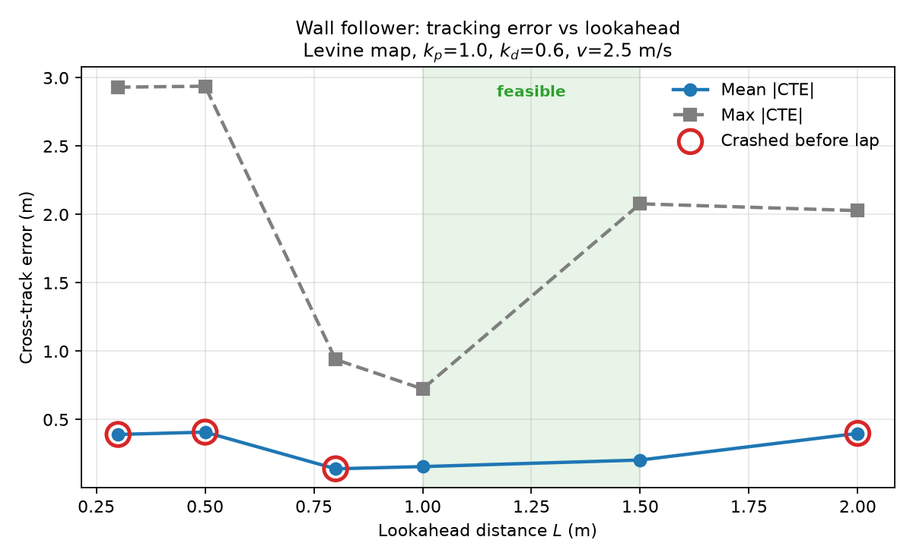
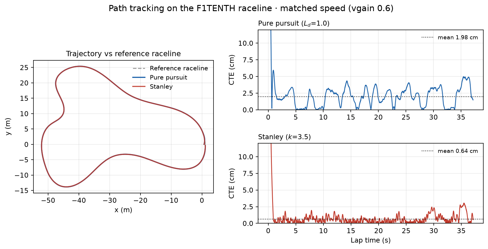
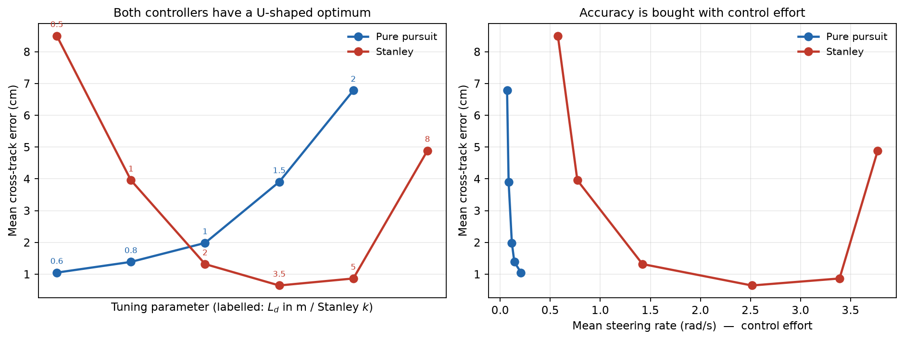
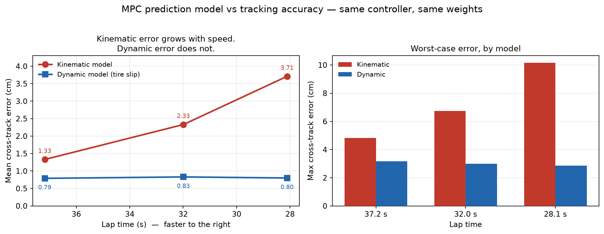

# F1TENTH Path-Tracking Study

Implementation and quantitative comparison of path-tracking controllers on the
[F1TENTH](https://f1tenth.org/) 1/10-scale autonomous vehicle platform.

The goal is not to build a car that drives. It is to **measure** how different
controllers trade tracking accuracy against speed, stability, and control
effort — and to find where each one breaks.

**Status:** four controllers in simulation, including MPC with both kinematic
and dynamic vehicle models. ROS 2 port next. Hardware in Spring 2027.

---

## Motivation

A path-tracking controller answers one question: given where I am, where I want
to be, and how fast I'm going, what steering angle do I command?

Every autonomous vehicle has one, and the tradeoffs are sharper than the
algorithms look. This repository implements several against the same vehicle
model, on the same track, with the same metrics, so they can be compared on
evidence rather than intuition.

---

## Setup

Verified on macOS (Apple Silicon), Python 3.11. See
[`SETUP_MACOS.md`](SETUP_MACOS.md) — the upstream `f1tenth_gym` package ships
stale dependency pins that need working around.

```bash
conda activate f1tenth
python wall_follower.py            # reactive controller, single run
python wall_follower.py sweep      # lookahead sweep
python path_tracking.py            # pure pursuit + Stanley
python path_tracking.py sweep      # parameter sweeps for both
python mpc.py                      # model predictive control
python mpc.py sweep                # horizon and speed sweep
python mpc_dyn.py                  # MPC with the dynamic (tire slip) model
python plot_tracking.py            # regenerate figures
```

---

## Simulation environment

`f1tenth_gym` provides a single-track (bicycle) vehicle model with tire slip,
load transfer, and steering rate limits, plus a 2D LiDAR raycast against an
occupancy map.

| | |
|---|---|
| Vehicle model | Single-track with cornering stiffness, friction limit, CG height |
| LiDAR | 1080 beams, 270 deg FOV |
| Timestep | 0.01 s (100 Hz) |
| Action | `[steering_angle (rad), speed (m/s)]` |
| Steering limit | +/- 0.4 rad |
| Throughput | ~115x realtime headless on an M-series Mac |

Running far faster than realtime is what makes parameter sweeps practical — a
30-point sweep takes seconds.

---

## Two problems, two error metrics

The controllers here solve related but distinct problems, and it matters which
error is being reported.

**Reactive control** (wall follower) has no map and no reference path. It reads
LiDAR and holds a set distance from a wall. Error is *wall-distance error*.

**Path tracking** (pure pursuit, Stanley) is given a reference path and must
follow it. Error is **cross-track error** — the perpendicular distance from the
vehicle to the path. Computed here by projecting onto every path segment and
taking the minimum, not by distance to the nearest waypoint, which would
quantise error to the waypoint spacing.

These numbers are not comparable across the two sections, which is why they are
reported separately.

---

## Part 1 — PID wall follower (reactive)

### Geometry

Two LiDAR beams against the left wall: one perpendicular (`b`, 90 deg) and one
angled forward (`a`, 40 deg), separated by theta = 50 deg.

    alpha = atan( (a*cos(theta) - b) / (a*sin(theta)) )
    D_t   = b * cos(alpha)

Using instantaneous distance alone oscillates, because the controller only
reacts to error already accumulated. Projecting a lookahead `L` forward gives
the distance the car *will* have on its current course:

    D_t+1 = D_t + L*sin(alpha)

PID acts on `e = D_desired - D_t+1`.

### Result: lookahead sweep

29 values from 0.60 to 2.00 m at 0.05 m resolution. Levine map, 2.5 m/s,
kp = 1.0, kd = 0.6.



**Only 9 of 29 runs completed a lap, and the survivors are scattered** — 0.75
laps, 0.80–0.95 all crash, 1.00 laps, 1.05–1.40 all crash, 1.45–1.50 lap.
A 0.05 m change flips the outcome.

An earlier six-point sweep at 0.25 m spacing happened to sample 1.0 and 1.5 and
suggested a contiguous "feasible window" between them. **That was a sampling
artifact.** Finer resolution shows a fragmented stability boundary instead.

### Findings

**1. Outcome is discontinuous; error is not.** Mean error creeps smoothly from
0.12 m to 0.40 m across the whole range with no cliffs, while survival flips
repeatedly. The metric that can be measured continuously says almost nothing
about the binary outcome that actually matters.

**2. Two repeatable failure modes.** Crashes cluster at ~7.5 s and ~18.5 s of
sim time — the same two corners, not random.

**3. The optimum depends entirely on the objective.** Best worst-case error is
L = 1.00 (max 0.724 m); best mean is L = 0.75 (0.123 m); fastest lap is
L = 1.65 (24.86 s). Three objectives, three different controllers.

**4. Derivative gain is fragile at 100 Hz.** Raising kd from 0.6 to 1.2,
everything else fixed, took max error from 0.724 m to 25.9 m. Differentiating a
fast noisy signal amplifies the noise until the controller fights itself.

**Caveat:** mean error for crashed runs is averaged only over the seconds before
impact, so it is not comparable to completed laps. Outcome is the primary
metric.

---

## Part 2 — Pure pursuit and Stanley (path tracking)

Both track an optimized raceline of 783 waypoints carrying position, heading,
curvature, and a target velocity profile.

### Pure pursuit

Picks a goal point one lookahead distance `Ld` ahead on the path and solves for
the steering angle of the circular arc from the rear axle to it:

    delta = atan( 2*L*sin(alpha) / Ld )

where `L` is the wheelbase and `alpha` the angle to the goal point in the
vehicle frame. Purely geometric — no notion of heading error.

### Stanley

Corrects cross-track and heading error separately, measured at the **front**
axle:

    delta = psi_error + atan( k*e / (v + k_soft) )

The correction term shrinks with speed to stay stable; `k_soft` keeps the
denominator finite at rest.

### Results

Matched speed profile (vgain 0.6), same raceline, same map.

| Controller | Mean CTE | Max CTE | Lap time | Mean steering rate |
|---|---|---|---|---|
| Pure pursuit (Ld = 1.0) | 1.98 cm | 5.51 cm | 37.19 s | 0.12 rad/s |
| Stanley (k = 3.5) | **0.64 cm** | **3.05 cm** | 37.14 s | 2.51 rad/s |





### Findings

**1. Stanley tracks ~3x tighter and pays ~20x the control effort.** At matched
speed it holds 0.64 cm against pure pursuit's 1.98 cm, but its mean steering
rate is 2.51 rad/s against 0.12. On a real vehicle that is actuator duty cycle
and ride quality, not a free win.

**2. The error signatures differ in kind, not just magnitude.** Pure pursuit
shows clean periodic humps — error rises to 4–5 cm through every corner and
falls on the straights. That is corner-cutting, exactly as the geometry
predicts: the controller aims at a point already partway around the bend.
Stanley shows low-amplitude high-frequency chatter instead. Predictable bias
versus continuous correction.

**3. Both have a U-shaped optimum.** Pure pursuit fails at Ld = 0.4 at every
speed tested (oscillates into the wall) and at 2.5 above vgain 0.5
(corner-cutting). Stanley is sluggish at k = 0.5 and unstable at k = 8. Neither
parameter is monotonic.

**4. Corner-cutting scales with lookahead as predicted.** At vgain 0.6, mean CTE
climbs monotonically 1.05 -> 6.78 cm as Ld goes 0.6 -> 2.0 m.

**Scope:** one track, one raceline, one speed profile. These are not general
claims about the controllers.

---

## Part 3 — Model predictive control

Pure pursuit and Stanley are *reactive*: they look at the current error and
respond. MPC is *predictive*. At every control step it simulates the vehicle
forward over a horizon, solves for the sequence of steering commands that
minimises a cost function, applies only the first one, and re-solves next step.

### Formulation

Written in **path-frame error coordinates**, not global position:

    state  e = [e_y, e_psi]      lateral offset from path, heading error
    input  delta                 steering angle

    e_y[k+1]   = e_y[k]   + dt*v[k]*e_psi[k]
    e_psi[k+1] = e_psi[k] + dt*v[k]/L*delta[k] - dt*v[k]*kappa[k]

    minimise  sum( q_y*e_y^2 + q_psi*e_psi^2 + r*delta^2 )
                + rd*(delta[k+1] - delta[k])^2
    s.t.      |delta| <= 0.4 rad

Solved as a QP with OSQP, horizon N = 10 at dt = 0.05 s, re-solved at 20 Hz
and held between solves.

### Three things the geometric controllers cannot do

**Curvature feedforward.** The raceline carries a curvature column. MPC samples
it over the horizon as a known disturbance, so it begins turning before any
error appears. Pure pursuit approximates this with a lookahead heuristic;
Stanley does not do it at all.

**Constraints inside the optimisation.** Pure pursuit and Stanley compute a
steering command and then clip it to the +/-0.4 rad limit, which silently
invalidates the geometry they just solved. MPC plans a trajectory that respects
the limit.

**Control effort as a tunable.** `rd` penalises steering rate directly, so the
accuracy-versus-effort tradeoff that is *fixed* for the geometric controllers
becomes a knob.

### Results

| Controller | Mean CTE | Max CTE | Lap time | Steering rate | Compute |
|---|---|---|---|---|---|
| Pure pursuit (Ld = 1.0) | 1.98 cm | 5.51 cm | 37.19 s | 0.12 rad/s | negligible |
| Stanley (k = 3.5) | **0.64 cm** | **3.05 cm** | 37.14 s | 2.51 rad/s | negligible |
| MPC (N = 10) | 1.39 cm | 4.26 cm | 37.18 s | 0.18 rad/s | 15 ms/solve |

Horizon and speed sweep, all nine configurations completing a lap:

| N | vgain | Lap time | Mean CTE | Max CTE | ms/solve |
|---|---|---|---|---|---|
| 6 | 0.6 | 37.18 s | 1.33 cm | 4.82 cm | 9.4 |
| 6 | 0.7 | 31.99 s | 2.33 cm | 6.75 cm | 9.4 |
| 6 | 0.8 | 28.11 s | 3.71 cm | 10.15 cm | 9.9 |
| 10 | 0.6 | 37.18 s | 1.39 cm | 4.26 cm | 15.4 |
| 10 | 0.8 | 28.12 s | 3.68 cm | 11.87 cm | 15.9 |
| 20 | 0.6 | 37.18 s | 1.34 cm | 4.50 cm | 31.5 |
| 20 | 0.8 | 28.12 s | 3.68 cm | 11.87 cm | 30.7 |

### Findings

**1. MPC is not the most accurate controller here. Stanley is.** At matched
speed Stanley holds 0.64 cm against MPC's 1.39 cm. The headline number does not
go to the most sophisticated method.

**2. MPC wins on accuracy per unit of control effort.** It is 1.4x tighter than
pure pursuit for 1.5x the steering activity. Stanley is 3x tighter for 20x the
activity. On that axis MPC dominates both — which is the actual argument for
optimisation-based control, not raw tracking accuracy.

**3. It is the only controller that laps cleanly at every speed tested.** All
nine sweep configurations completed, including vgain 0.8 at 28.11 s — faster
than any lap by the other controllers.

**4. Longer horizons are not better.** N = 6 and N = 20 track identically
(1.33 vs 1.34 cm) while N = 20 costs 3.3x the compute. At this speed, curvature
far ahead does not change the immediate steering decision.

**5. Worst case degrades faster than average with speed.** From vgain 0.6 to
0.8, mean CTE grows 2.8x but max CTE grows 2.5-2.8x and reaches 11.9 cm. The
same mean-versus-max divergence that showed up in the wall follower.

**6. The compute cost is real but not prohibitive.** ~1000x the arithmetic of a
geometric controller for a 1.4x accuracy gain — but 15 ms/solve on a laptop
means this runs at 60 Hz on real hardware.


---

## Part 4 — Does the prediction model matter?

Kinematic-model MPC left a clear signature: mean tracking error grew from
1.33 cm to 3.71 cm as lap time dropped from 37.2 s to 28.1 s. Nearly 3x worse,
purely from going faster.

That pattern points at model mismatch rather than at the optimiser. MPC solves
exactly — but for the vehicle its model describes. The kinematic bicycle model
assumes tires go where they point. Real tires generate lateral force only by
slipping, and slip grows with lateral acceleration, so the model gets worse the
faster you drive.

**Test:** swap the prediction model, change nothing else. Same cost weights,
same horizon, same solver, same raceline.

### The dynamic bicycle model

State becomes four-dimensional (Rajamani Ch. 3):

    x = [e_y, e_y_dot, e_psi, e_psi_dot]

Tire lateral force is proportional to slip angle through cornering stiffness.
Axle cornering stiffness is derived from the simulator's per-unit-load
coefficients and the static axle loads:

    F_zf = m*g*lr/L = 19.0 N        F_zr = m*g*lf/L = 17.6 N
    C_f  = C_Sf * F_zf = 89.9 N/rad
    C_r  = C_Sr * F_zr = 96.2 N/rad

Path curvature enters as a desired yaw rate disturbance, psi_dot_des = v*kappa.

### Result

| vgain | Lap time | Kinematic mean | Dynamic mean | Kinematic max | Dynamic max |
|---|---|---|---|---|---|
| 0.6 | 37.2 s | 1.33 cm | **0.79 cm** | 4.82 cm | **3.17 cm** |
| 0.7 | 32.0 s | 2.33 cm | **0.83 cm** | 6.75 cm | **3.00 cm** |
| 0.8 | 28.1 s | 3.71 cm | **0.80 cm** | 10.15 cm | **2.87 cm** |



### Findings

**1. The speed dependence disappears entirely.** Kinematic error nearly triples
across the speed range; dynamic error is flat at 0.79 / 0.83 / 0.80 cm. Since
nothing but the prediction model changed, the speed-dependent component of the
kinematic error was model mismatch, not optimisation error, discretisation, or
horizon length.

**2. Worst-case improves more than average.** At the fastest setting, max error
drops from 10.15 cm to 2.87 cm — a 3.5x improvement against 4.6x on the mean.
The corners, where lateral acceleration is highest and slip matters most, are
exactly where the better model pays.

**3. It becomes the best controller in the study on effort-adjusted accuracy.**
0.79 cm at 0.08 rad/s mean steering rate. Stanley reaches 0.64 cm but spends
2.51 rad/s — 31x the actuator activity for 20% better tracking.

**4. It also solves faster: 2.1 ms vs 15 ms**, despite twice the state
dimension. Passing A, B and C as matrix parameters is far more solver-friendly
than the element-wise parameter products the kinematic version used.

### Understeer gradient

The same parameters give a standard vehicle dynamics quantity:

    K = (m/L) * (lr/C_f - lf/C_r) = +0.00292 rad/(m/s^2)

Positive K means the platform **understeers** — at the limit it pushes wide
rather than rotating. That follows from rear cornering stiffness exceeding
front (96.2 vs 89.9 N/rad), which is how essentially every production passenger
car is deliberately set up, because understeer is recoverable and oversteer
generally is not.


---

## Two bugs worth documenting

Stanley initially crashed 0.47 s into every run, at every gain value — including
gains an order of magnitude apart, which produced *identical* logs.

Gain-independence was the tell. If the gain does not matter, the steering
command is saturating, which means the error term is enormous from the first
step.

The raceline's `psi_rad` column uses a heading convention rotated pi/2 from
standard `atan2(dy, dx)`. Verified against path geometry: mean offset 1.5728 rad
across all 783 waypoints, standard deviation 0.058.

**Pure pursuit never caught it.** It is purely geometric and never reads the
stored heading — it derives everything from waypoint positions. Stanley consumes
path heading directly and so was fully exposed.

A silent data-convention mismatch that one consumer is immune to and another is
not is a real class of integration failure, and worth having found once.

### 2. MPC in global coordinates: the weights that did nothing

The first MPC attempt tracked absolute x, y, and theta against absolute
waypoints. It crashed at the same corner every lap, at 13.19 s, regardless of
cost weights — `q_pos` swept from 20 to 2000, `q_yaw` from 0 to 10, rate
penalties across an order of magnitude. Every run failed within 0.6 s of the
same point.

**Weight-independence was the tell**, exactly as gain-independence had been for
Stanley: if the knobs do not change the outcome, the problem is not the knobs.

Ruled out along the way: steering sign (verified empirically against the
simulator — +0.25 rad produced +0.53 rad of heading change), numerical
conditioning (shifting the QP into local coordinates changed nothing),
overspeed (removing a 10% speed allowance bought 0.5 s), and timestep and
horizon length (finer discretisation made it worse).

The cause was the formulation itself. Vehicle heading accumulates without bound
over a lap — theta exceeded 4 rad and kept climbing — and the affine
linearisation terms scale with theta, so the QP conditions progressively worse
as the lap proceeds. Rewriting in path-frame error coordinates fixed it on the
first attempt: every state now sits near zero, the linearisation stays valid,
and the cost weights carry physical meaning.

Both bugs were diagnosed the same way: *the knob does not matter, so the problem
is not the knob.*

---

## Roadmap

- [x] Simulation environment, headless, CSV logging
- [x] PID wall follower + stability characterisation
- [x] Pure pursuit against an optimized raceline
- [x] Stanley controller
- [x] True cross-track error and control-effort metrics
- [x] MPC over the bicycle model (path-frame error coordinates, OSQP)
- [x] Vehicle dynamics: kinematic vs dynamic prediction model, understeer gradient
- [ ] Vehicle dynamics: friction sweep, load transfer, CG position
- [ ] Port to ROS 2 nodes
- [ ] Hardware build (Raspberry Pi 5, RPLIDAR C1, 1/10 chassis)
- [ ] Sim-to-real: same controllers, measured gap

---

## References

- O'Kelly et al., *F1TENTH: An Open-source Evaluation Environment for Continuous
  Control and Reinforcement Learning*, NeurIPS 2019 Competition Track
- Coulter, *Implementation of the Pure Pursuit Path Tracking Algorithm*,
  CMU-RI-TR-92-01
- Hoffmann et al., *Autonomous Automobile Trajectory Tracking for Off-Road
  Driving*, ACC 2007
- Rajamani, *Vehicle Dynamics and Control*, 2nd ed.
